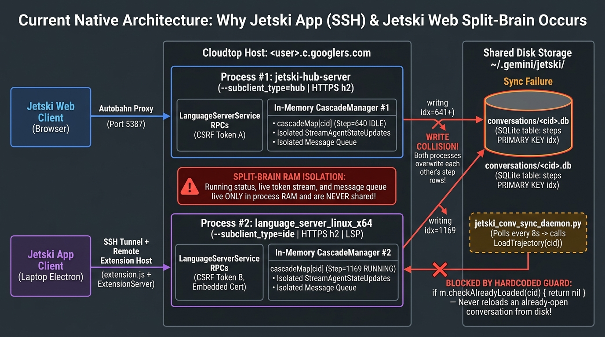

# Jetski App (SSH) ↔ Jetski Web (Hub) 全景同步指南与三层解决方案

> **面向 Google Cloudtop / 远端工作站开发者的双端无缝协同工程指南**  
> 彻底打通 **Jetski App (Remote-SSH IDE)** 与 **Jetski Web (Hub Browser)** 之间的：  
> 1️⃣ **Project / Workspace 映射同步**  
> 2️⃣ **同 Project 内跨客户端 Conversation 双向同步**  
> 3️⃣ **同一 Conversation 内多轮对话、实时流 (`RUNNING`) 与消息排队 (`QueuedSteps`) 的毫秒级单脑同步**

---

## 📌 一、背景痛点：为什么连同一台 Cloudtop，App 和 Web 却是割裂的？

在日常研发中，很多工程师会同时结合使用两种客户端访问同一台远端工作站（Cloudtop）：
- **💻 Jetski App (SSH / VS Code Antigravity Extension)**：适合深度手写代码、Tab 行内补全、单窗口沉浸式调试；
- **🌐 Jetski Web (`go/jetski-hub`)**：适合笔记本合盖后台跑长任务、多项目秒切、定时 Automation 与全局全文搜索（FTS5）。

然而，即便两个客户端连接的是**同一台 Linux 主机**、读写**同一个 `$HOME/.gemini/jetski/` 目录**，在默认架构下仍会遇到**三个由浅入深的同步割裂问题**：

| 场景层级 | 典型割裂现象 | 核心源码级根因 | 本仓库提供的解决方案 | 同步延迟与效果 |
| :--- | :--- | :--- | :--- | :--- |
| **场景 1：<br/>Project / Workspace 同步** | • 在 App (SSH) 打开的新 Git 仓库，在 Web 侧边栏没有对应的 Project；<br/>• 历史无 Project 会话全部堆积在 `outside-of-project`（实测占比可达 30%+）；<br/>• App 历史下拉框把所有项目的会话混在一起显示。 | • **Web 是 Project-First (`project_id` UUID)**：读取 `~/.gemini/config/projects/<uuid>.json` 并强制校验 `.db` 中 `trajectory_metadata_blob` 的 **Protobuf Field 18 (`project_id`)**；<br/>• **App 是 Folder-First (`--workspace_id`)**：`settings_store.go` 中 `projectID=""` 恒为空，`.db` 仅写 **Protobuf Field 7 (`workspace_uris`)**，从不生成 Project JSON 或写 Field 18。 | **[`jetski_conv_sync_daemon.py`](src/scenario1_2_daemon/jetski_conv_sync_daemon.py)**<br/>• 自动双向扫描 `--workspace_id`、Field 7 与 `projects/*.json`；<br/>• 自动调用 `CreateProject` RPC 注册缺失的 Web Project；<br/>• 自动向 `.db` 注入二进制 `Field 18 (\x92\x01\x24 + UUID)` 并导出 `.code-workspace`。 | **8 秒内自动建项归档** |
| **场景 2：<br/>同 Project 内不同 Conversation 同步** | • 在 App 里新建的会话，切到 Web 对应 Project 下找不到；<br/>• 在 Web 里新建的会话，回到 App 的历史列表里也看不见。 | • **Web 仅启动扫盘一次**：`reconcileSummariesOnce` 仅在 `jetski-hub-server` 启动时运行一次，无 `fsnotify` 监听新 `.db`；<br/>• **App 从不扫盘**：App 完全依赖后台进程调用 `ExtensionServerService/PushUnifiedStateSyncUpdate` 推送 `trajectorySummaries` 到本地 `state.vscdb`。 | **[`jetski_conv_sync_daemon.py`](src/scenario1_2_daemon/jetski_conv_sync_daemon.py)**<br/>• 动态发现双端进程端口与 CSRF Token；<br/>• 检测到新 `.db` 或步数增加时，自动向对端发送 `LanguageServerService/LoadTrajectory` RPC，触发 `LoadUnsafe -> updateSummary -> USS 推送`。 | **8 秒内双向同步**<br/>*(仅限对端尚未加载进内存的会话)* |
| **场景 3：<br/>同一 Conversation 内轮次会话与执行任务 (`RUNNING`) 同步** | • 同一会话在两端都打开后，在 App 继续聊 10 轮，Web 永远卡在旧步数；<br/>• App 正在执行任务 (`RUNNING`) 时，Web 端看不到实时流，且在 Web 发消息会直接覆盖 App 写在 SQLite 里的步骤！ | • **源码硬编码拦截**：`cascade_manager.go:1454` 中 `if m.checkAlreadyLoaded(ctx, cascadeID) { return nil }` 导致已加载进内存 `cascadeMap` 的会话**永不重新读盘**；<br/>• **运行时状态纯内存驻留**：`RUNNING` 状态、`StreamAgentStateUpdates` 实时流与 `QueuedSteps` 排队队列仅存在于单进程 RAM 中；<br/>• **SQLite 主键覆盖冲突**：两进程各自按内存步数向 `steps (PRIMARY KEY idx)` 执行 `INSERT OR REPLACE` 互相覆盖。 | **[`jetski_hub_bridge.go`](src/scenario3_bridge/jetski_hub_bridge.go)**<br/>• 利用 `extension.js` 原生内置的 `persistentLanguageServer` + `daemon/ls_<hash>.json` 热发现机制接管 SSH 端；<br/>• 本地 Go HTTP/2 TLS 反向代理（挂载本机提取证书、自动重写 CSRF Token、`FlushInterval: -1`）将所有 `LanguageServerService` 请求零延迟直通转发至唯一的 **`jetski-hub-server`** 单脑进程。 | **0ms 毫秒级真·实时流式同步 + 跨端统一消息排队 + 零写冲突** |

---

## 🖼️ 二、三大场景架构流程图（Nano Banana 绘制）

### 1. 场景一：Project 与 Workspace 跨端映射与 Protobuf Field 18 自动缝合架构


---

### 2. 原生默认双进程架构：为什么同一会话会出现脑裂割裂（Split-Brain）与 SQLite 写覆盖？


---

### 3. 场景三：`jetski_hub_bridge` 单脑桥接架构 —— 接管 SSH 客户端实现毫秒级实时流与统一排队


---

## ⏱️ 三、不依赖单脑桥接时：App (SSH) 与 Web 双客户端访问后台全过程合并时序图

下面这张合并时序图完整还原了**在不启用 `jetski_hub_bridge` 的原生双进程架构下**，**Jetski App (SSH)** 与 **Jetski Web** 同时访问同一台 Cloudtop 的全生命周期交互过程（涵盖双端独立启动、首次加载为何能成功、同一会话多轮对话为何被 `checkAlreadyLoaded` 拦截割裂、以及并发发消息引发的 SQLite `steps(idx)` 覆盖与 Task 串扰）：

```mermaid
sequenceDiagram
    autonumber
    actor User as 👤 开发者 (User)
    participant AppUI as 💻 Jetski App UI<br/>(Laptop Electron)
    participant ExtHost as 🔌 SSH Remote Extension<br/>(extension.js + ExtensionServer)
    participant AppLS as 🧠 进程 #2: language_server_linux_x64<br/>(--subclient_type=ide)<br/>[独立内存 CascadeManager #2]
    participant DiskDB as 🗄️ 共享磁盘 SQLite & Brain<br/>(conversations/<cid>.db<br/>brain/<cid>/tasks/)
    participant SyncDaemon as 🔄 jetski_conv_sync_daemon.py<br/>(每 8s 轮询守护进程)
    participant HubLS as 🧠 进程 #1: jetski-hub-server<br/>(--subclient_type=hub)<br/>[独立内存 CascadeManager #1]
    participant WebUI as 🌐 Jetski Web UI<br/>(Browser via Autobahn :5387)

    rect rgb(30, 41, 59)
    Note over AppUI,WebUI: 【阶段 1】Web 端与 App (SSH) 端各自启动独立的后端进程（双脑内存隔离）
    WebUI->>HubLS: 1. 浏览器访问 :5387 (Autobahn 转发至 Hub HTTPS 端口, CSRF Token A)
    HubLS->>DiskDB: 2. 启动时仅执行一次 reconcileSummariesOnce 读取 conversation_summaries.db
    AppUI->>ExtHost: 3. Laptop 通过 SSH 隧道连接 Cloudtop Remote Extension Host
    ExtHost->>AppLS: 4. spawn("language_server_linux_x64 --subclient_type ide --workspace_id file_... --csrf_token TokenB")
    AppLS-->>ExtHost: 5. LanguageServerStarted(httpsPort, httpPort, lspPort) [注: settings_store.go 中 projectID=""]
    ExtHost-->>AppUI: 6. setPort(httpsPort) + setCsrfToken(TokenB)，建立 SSH 端口转发隧道
    end

    rect rgb(20, 55, 45)
    Note over AppUI,WebUI: 【阶段 2】为什么「不同会话 / 另一端尚未点开过的会话」首次同步能成功？（场景 1 & 2）
    User->>AppUI: 7. 在 App 中创建/打开会话 cid (执行到 Step 640)
    AppUI->>AppLS: 8. SendUserCascadeMessage(cid) & StreamAgentStateUpdates(cid)
    AppLS->>AppLS: 9. 写入内存 CascadeManager #2: cascadeMap[cid] (Step=640, IDLE)
    AppLS->>DiskDB: 10. 写入 cid.db (仅含 Field 7 workspace_uri, 缺失 Field 18 project_id)
    SyncDaemon->>DiskDB: 11. 扫描发现 cid.db 缺失 Field 18 -> 自动匹配/创建 Project JSON 并注入 \x92\x01\x24 + project_id
    SyncDaemon->>HubLS: 12. POST /LanguageServerService/LoadTrajectory({"cascadeId": cid})
    HubLS->>HubLS: 13. checkAlreadyLoaded(cid) == false (Web 内存尚未加载过 cid!)
    HubLS->>DiskDB: 14. LoadUnsafe 从磁盘读取 Step 1..640 存入 CascadeManager #1 并写入 conversation_summaries.db
    User->>WebUI: 15. 用户第一次在 Web 打开 cid -> 看到完整的 Step 1..640 ✅
    WebUI->>HubLS: 16. 订阅 HubLS 内存流 StreamAgentStateUpdates(cid)
    end

    rect rgb(65, 30, 35)
    Note over AppUI,WebUI: 【阶段 3】核心割裂点：两端都已加载 cid 后，App 继续跑到 Step 1169，Web 为什么完全不更新？
    User->>AppUI: 17. 用户切回 App (SSH)，在同一个 cid 中继续多轮对话 (Step 641 -> 1169)
    AppUI->>AppLS: 18. SendUserCascadeMessage(cid, "继续执行任务...")
    AppLS->>AppLS: 19. CascadeManager #2 状态变为 RUNNING，内存步数递增至 Step 1169
    AppLS-->>AppUI: 20. StreamAgentStateUpdates 实时推送 Step 641..1169 流式输出 (仅发往 AppUI!)
    AppLS->>DiskDB: 21. 将 Step 641..1169 写入磁盘 cid.db (steps 表 idx=641..1169)
    SyncDaemon->>DiskDB: 22. 轮询发现 cid.db 的步数增长 (1169 > 640)
    SyncDaemon->>HubLS: 23. POST /LanguageServerService/LoadTrajectory({"cascadeId": cid})
    HubLS->>HubLS: 24. ❌ 命中硬编码拦截: if m.checkAlreadyLoaded(cid) { return nil } !<br/>因为 cid 在步骤 14 已存在于 HubLS 的 cascadeMap[cid] 中，直接返回空，绝不重新读盘！
    User->>WebUI: 25. 用户切到 Web 查看同一个 cid
    HubLS-->>WebUI: 26. ❌ Web 端依然返回 HubLS 内存里的旧快照 (卡在 Step 640, 状态 IDLE)，<br/>完全看不到 App 正在执行的 Step 641..1169！
    end

    rect rgb(70, 40, 20)
    Note over AppUI,WebUI: 【阶段 4】当 App 正在 RUNNING (Step 1169) 时，用户在 Web 发起新一轮对话会发生什么？
    User->>WebUI: 27. 用户在 Web 的同一个 cid 输入新消息（期望进入下一轮排队队列 QueuedSteps）
    WebUI->>HubLS: 28. SendUserCascadeMessage(cid, "下一轮指令...")
    HubLS->>HubLS: 29. ❌ HubLS 检查自己内存 CascadeManager #1：认为 cid 处于 IDLE (Step 640)！<br/>不会进入 AppLS 的队列，而是直接在 HubLS 内存里从 idx=641 重新开始执行！
    HubLS->>DiskDB: 30. 💥 写冲突 (Write Collision)：HubLS 执行 INSERT OR REPLACE INTO steps (idx=641..730)，<br/>直接把 AppLS 写在磁盘 cid.db 里的第 641..730 步覆盖掉！
    AppLS->>DiskDB: 31. AppLS 的后台任务写入共享目录 brain/<cid>/.system_generated/tasks/
    DiskDB-->>HubLS: 32. ⚠️ 跨进程串扰：共享目录的后台任务完成通知唤醒另一端，但两边内存上下文完全不一致！
    end
```



---

## 📚 四、深度专题文档导航

1. 📄 **[`docs/01-web-vs-app-comparison.md`](docs/01-web-vs-app-comparison.md)**  
   **Jetski Web (Hub) vs. Jetski App (SSH) 八大维度全景对比与双端互补最佳实践**
2. 📄 **[`docs/02-scenario1-project-workspace.md`](docs/02-scenario1-project-workspace.md)**  
   **场景一深度调研与方案：App 与 Web 之间的 Project / Workspace 数据结构、源码机制与自动缝合**  
   *(含 `~/.gemini/config/projects/*.json` 结构、`StandaloneProjectID = "outside-of-project"` 成因、`projects_migration.go` 局限性及双向自动建项机制)*
3. 📄 **[`docs/03-scenario2-conversation-sync.md`](docs/03-scenario2-conversation-sync.md)**  
   **场景二深度解析与方案：同一 Project 下不同 Conversation 的 8 秒级无感双向同步 (`LoadTrajectory`)**
4. 📄 **[`docs/04-scenario3-single-brain-bridge.md`](docs/04-scenario3-single-brain-bridge.md)**  
   **场景三深度解析与方案：同一 Conversation 内多轮对话、实时流 (`RUNNING`) 与消息排队的 `jetski_hub_bridge` 单脑接管方案**

---

## 🚀 五、快速安装与使用指南（100% 动态适配 `$HOME` / `$USER`）

### 模式 A：部署场景 1 + 场景 2（后台轻量级守护进程，自动同步 Project 与新建会话）
```bash
./scripts/install.sh --mode daemon
```
- 自动安装 `$HOME/.gemini/jetski/bin/jetski_conv_sync_daemon.py` 并启用 `systemd --user` 常驻服务 `jetski-conv-sync.service`；
- 每 8 秒自动执行：**SSH 工作区向 Web Project 自动注册** + **Protobuf Field 18 (`project_id`) 修补** + **`outside-of-project` 会话自动归档** + **双端 `LoadTrajectory` 增量推送**。

### 模式 B：启用场景 3（包含模式 A + 编译部署 `jetski_hub_bridge` 单脑 HTTP/2 实时桥接器）
```bash
./scripts/install.sh --mode bridge
```
- 自动从本机 `$HOME/.jetski-server/bin/` 提取本地 TLS 证书与私钥（**绝不硬编码入库**），编译 `jetski_hub_bridge`；
- 调用 `enable_unified_bridge.py --enable`：自动检测并等待当前 SSH 端正在运行的任务变为 `IDLE`，随后写入 `$HOME/.jetski-server/data/Machine/settings.json`（`antigravity.persistentLanguageServer: true`）与 discovery 文件，让 SSH 客户端在 1 秒内热切换至 `jetski-hub-server` 单脑进程。

### 查看状态或一键回滚原生模式
```bash
# 查看当前双端进程、Project 映射与桥接状态
python3 ~/.gemini/jetski/bin/enable_unified_bridge.py --status

# 随时关闭单脑桥接，恢复原生独立双进程模式
python3 ~/.gemini/jetski/bin/enable_unified_bridge.py --disable

# 完全卸载所有同步服务与配置
./scripts/uninstall.sh
```
