<div align="center">

# Jetski App (SSH) ↔ Jetski Web (Hub) Synchronization Guide & 3-Tier Suite

**[🇨🇳 简体中文](./README.md) | [🌐 English](./README_EN.md)**

</div>

> **A Seamless Dual-Client Engineering Guide for Google Cloudtop & Remote Workstation Developers**  
> Comprehensively bridging **Jetski App (Remote-SSH IDE)** and **Jetski Web (Hub Browser)** across 3 progressive scenarios:  
> 1️⃣ **Scenario 1: Project / Workspace Mapping & Metadata Healing**  
> 2️⃣ **Scenario 2: Cross-Client Conversation List Synchronization Within the Same Project**  
> 3️⃣ **Scenario 3: Zero-Latency Multi-Turn History, Live Streaming (`RUNNING`), and Unified Message Queue (`QueuedSteps`) via Single-Brain Bridge**

---

## 📌 1. The Core Problem: Why Are App (SSH) and Web Disconnected on the Same Cloudtop?

In daily development, many engineers combine two clients connected to the exact same remote workstation (Cloudtop):
- **💻 Jetski App (SSH / VS Code Antigravity Extension)**: Ideal for deep hands-on coding, inline Tab completions, and immersive single-window debugging;
- **🌐 Jetski Web (`go/jetski-hub`)**: Ideal for running long background tasks with the laptop lid closed, instant multi-project switching, scheduled Automations, and full-text search (FTS5).

However, even though both clients connect to the **same Linux host** and read/write the **same `$HOME/.gemini/jetski/` directory**, they suffer from **three progressive synchronization gaps** under the default architecture:

| Scenario Tier | Typical Symptoms | Root Cause in Source Code | Solution Provided in This Repo | Sync Latency & Effect |
| :--- | :--- | :--- | :--- | :--- |
| **Scenario 1:<br/>Project / Workspace Sync** | • A new Git repo opened in App (SSH) does not appear as a Project in Web's sidebar;<br/>• Over 30% of historical chats fall into `outside-of-project`;<br/>• App's history dropdown mixes conversations from all projects together. | • **Web is Project-First (`project_id` UUID)**: Reads `~/.gemini/config/projects/<uuid>.json` and strictly checks **Protobuf Field 18 (`project_id`)** inside `trajectory_metadata_blob`;<br/>• **App is Folder-First (`--workspace_id`)**: `settings_store.go` sets `projectID=""` (always empty), writes only **Protobuf Field 7 (`workspace_uris`)**, and never creates Project JSONs or Field 18. | **[`jetski_conv_sync_daemon.py`](src/scenario1_2_daemon/jetski_conv_sync_daemon.py)**<br/>• Bidirectionally scans `--workspace_id`, Field 7, and `projects/*.json`;<br/>• Calls `CreateProject` RPC to auto-register missing Web Projects;<br/>• Binary-patches `Field 18 (\x92\x01\x24 + UUID)` into `.db` and exports `.code-workspace`. | **Auto-grouped within 8 seconds** |
| **Scenario 2:<br/>Conversation List Sync Within the Same Project** | • A new conversation created in App is missing under the project in Web;<br/>• A new conversation created in Web is invisible in App's history dropdown. | • **Web scans disk only once at startup**: `reconcileSummariesOnce` runs only when `jetski-hub-server` boots, with no `fsnotify` watcher for new `.db` files;<br/>• **App never scans disk**: App relies entirely on `ExtensionServerService/PushUnifiedStateSyncUpdate` pushing `trajectorySummaries` into local `state.vscdb`. | **[`jetski_conv_sync_daemon.py`](src/scenario1_2_daemon/jetski_conv_sync_daemon.py)**<br/>• Dynamically discovers ports and CSRF tokens of both processes;<br/>• Calls `LanguageServerService/LoadTrajectory` RPC when new `.db` files appear, triggering `LoadUnsafe -> updateSummary -> USS Push`. | **Bidirectional sync within 8s**<br/>*(Only for conversations not yet loaded in peer RAM)* |
| **Scenario 3:<br/>Same-Conversation Multi-Turn & Live Task (`RUNNING`) Sync** | • Once a conversation is opened on both clients, chatting 10 more turns in App leaves Web frozen at the old step count;<br/>• While App is `RUNNING`, Web shows `IDLE`, and sending a message on Web overwrites App's steps in SQLite! | • **Hardcoded memory guard**: `if m.checkAlreadyLoaded(ctx, cascadeID) { return nil }` in `cascade_manager.go:1454` prevents any conversation already in `cascadeMap` RAM from ever reloading from disk;<br/>• **Pure in-memory runtime state**: `RUNNING` status, `StreamAgentStateUpdates` channels, and `QueuedSteps` reside solely in single-process RAM;<br/>• **SQLite PK collision**: Both processes execute `INSERT OR REPLACE INTO steps (PRIMARY KEY idx)` using their own in-memory step counters. | **[`jetski_hub_bridge.go`](src/scenario3_bridge/jetski_hub_bridge.go)**<br/>• Leverages `extension.js`'s native `persistentLanguageServer` + `daemon/ls_<hash>.json` hot-discovery;<br/>• Local Go HTTP/2 TLS reverse proxy (using locally extracted cert, CSRF rewriting, and `FlushInterval: -1`) routes all SSH `LanguageServerService` traffic directly to the single **`jetski-hub-server`** brain. | **0ms real-time streaming + unified cross-client queue + zero SQLite write conflict** |

---

## 🖼️ 2. Architecture Flowcharts Across All 3 Scenarios (Generated with Nano Banana)

> 💡 For Simplified Chinese diagrams, switch to **[🇨🇳 简体中文 README](./README.md)** or browse [`docs/assets/`](docs/assets/).

### 1. Scenario 1: Project & Workspace Cross-Client Mapping & Protobuf Field 18 Stitching


---

### 2. Native Dual-Process Architecture: Why Split-Brain & SQLite Write Collisions Happen


---

### 3. Scenario 3: `jetski_hub_bridge` Single-Brain Architecture — Zero-Latency Streaming & Unified Queue


---

## ⏱️ 3. Combined Sequence Diagram: Native Dual-Client Lifecycle (Without Single-Brain Bridge)

The combined sequence diagram below illustrates the complete lifecycle when **Jetski App (SSH)** and **Jetski Web** access the same Cloudtop **under the default dual-process architecture (without `jetski_hub_bridge`)** — showing independent process startup, why initial sync succeeds (Scenarios 1 & 2), why subsequent turns in the same conversation are blocked by `checkAlreadyLoaded`, and how concurrent messages cause SQLite `steps(idx)` write collisions:

```mermaid
sequenceDiagram
    autonumber
    actor User as 👤 Developer (User)
    participant AppUI as 💻 Jetski App UI<br/>(Laptop Electron)
    participant ExtHost as 🔌 SSH Remote Extension<br/>(extension.js + ExtensionServer)
    participant AppLS as 🧠 Process #2: language_server_linux_x64<br/>(--subclient_type=ide)<br/>[Isolated CascadeManager #2]
    participant DiskDB as 🗄️ Shared Disk SQLite & Brain<br/>(conversations/<cid>.db<br/>brain/<cid>/tasks/)
    participant SyncDaemon as 🔄 jetski_conv_sync_daemon.py<br/>(8s Polling Daemon)
    participant HubLS as 🧠 Process #1: jetski-hub-server<br/>(--subclient_type=hub)<br/>[Isolated CascadeManager #1]
    participant WebUI as 🌐 Jetski Web UI<br/>(Browser via Autobahn :5387)

    rect rgb(30, 41, 59)
    Note over AppUI,WebUI: [Phase 1] Web & App (SSH) Spawn Separate Backend Processes (Isolated RAM)
    WebUI->>HubLS: 1. Browser connects via :5387 (Autobahn forwards to Hub HTTPS port, CSRF Token A)
    HubLS->>DiskDB: 2. Runs reconcileSummariesOnce ONLY once at startup
    AppUI->>ExtHost: 3. Laptop connects via SSH tunnel to Cloudtop Remote Extension Host
    ExtHost->>AppLS: 4. spawn("language_server_linux_x64 --subclient_type ide --workspace_id file_... --csrf_token TokenB")
    AppLS-->>ExtHost: 5. LanguageServerStarted(httpsPort, httpPort, lspPort) [Note: projectID="" in settings_store.go]
    ExtHost-->>AppUI: 6. setPort(httpsPort) + setCsrfToken(TokenB), establishing SSH port-forwarding tunnel
    end

    rect rgb(20, 55, 45)
    Note over AppUI,WebUI: [Phase 2] Why First-Time Sync Succeeds for Unloaded Conversations (Scenarios 1 & 2)
    User->>AppUI: 7. Creates/runs conversation cid in App (up to Step 640)
    AppUI->>AppLS: 8. SendUserCascadeMessage(cid) & StreamAgentStateUpdates(cid)
    AppLS->>AppLS: 9. Updates in-memory CascadeManager #2: cascadeMap[cid] (Step=640, IDLE)
    AppLS->>DiskDB: 10. Writes cid.db (contains Field 7 workspace_uri ONLY, missing Field 18 project_id)
    SyncDaemon->>DiskDB: 11. Detects missing Field 18 -> matches/creates Project JSON & injects \x92\x01\x24 + project_id
    SyncDaemon->>HubLS: 12. POST /LanguageServerService/LoadTrajectory({"cascadeId": cid})
    HubLS->>HubLS: 13. checkAlreadyLoaded(cid) == false (cid not in HubLS RAM yet!)
    HubLS->>DiskDB: 14. LoadUnsafe reads Steps 1..640 into CascadeManager #1 & updates conversation_summaries.db
    User->>WebUI: 15. User opens cid in Web for the first time -> sees full Steps 1..640 ✅
    WebUI->>HubLS: 16. Subscribes to HubLS stream StreamAgentStateUpdates(cid)
    end

    rect rgb(65, 30, 35)
    Note over AppUI,WebUI: [Phase 3] The Split-Brain Trap: Once Loaded on Both Ends, Why Web Freezes at Old Steps
    User->>AppUI: 17. User switches back to App (SSH) and continues chatting in cid (Step 641 -> 1169)
    AppUI->>AppLS: 18. SendUserCascadeMessage(cid, "Continue task...")
    AppLS->>AppLS: 19. CascadeManager #2 enters RUNNING state, incrementing RAM counter to Step 1169
    AppLS-->>AppUI: 20. StreamAgentStateUpdates streams Steps 641..1169 (sent ONLY to AppUI!)
    AppLS->>DiskDB: 21. Persists Steps 641..1169 to disk cid.db (steps table idx=641..1169)
    SyncDaemon->>DiskDB: 22. Detects step count increase on disk (1169 > 640)
    SyncDaemon->>HubLS: 23. POST /LanguageServerService/LoadTrajectory({"cascadeId": cid})
    HubLS->>HubLS: 24. ❌ Blocked by hardcoded guard: if m.checkAlreadyLoaded(cid) { return nil } !<br/>Because cid is already in HubLS cascadeMap[cid] from Step 14, it returns nil without reading disk!
    User->>WebUI: 25. User checks cid in Web UI
    HubLS-->>WebUI: 26. ❌ Web still serves stale snapshot from HubLS RAM (stuck at Step 640, IDLE)!
    end

    rect rgb(70, 40, 20)
    Note over AppUI,WebUI: [Phase 4] Write Collision When Sending a Message on Web While App Is RUNNING
    User->>WebUI: 27. User sends a new message in Web (expecting it to enter QueuedSteps)
    WebUI->>HubLS: 28. SendUserCascadeMessage(cid, "Next instruction...")
    HubLS->>HubLS: 29. ❌ HubLS checks CascadeManager #1 RAM: sees cid as IDLE at Step 640!<br/>Starts executing immediately from idx=641 instead of queuing!
    HubLS->>DiskDB: 30. 💥 Write Collision: HubLS runs INSERT OR REPLACE INTO steps (idx=641..730),<br/>silently overwriting AppLS's Steps 641..730 on disk!
    AppLS->>DiskDB: 31. AppLS background task writes to shared brain/<cid>/.system_generated/tasks/
    DiskDB-->>HubLS: 32. ⚠️ Cross-process interference: background task notifications wake the wrong memory context!
    end
```



---

## 📚 4. Deep-Dive Technical Documentation

1. 📄 **[`docs/en/01-web-vs-app-comparison.md`](docs/en/01-web-vs-app-comparison.md)** ([中文版](docs/01-web-vs-app-comparison.md))  
   **8-Dimension Comparison Between Jetski Web (Hub) & Jetski App (SSH) and Best Practices**
2. 📄 **[`docs/en/02-scenario1-project-workspace.md`](docs/en/02-scenario1-project-workspace.md)** ([中文版](docs/02-scenario1-project-workspace.md))  
   **Scenario 1 Deep Dive: Project / Workspace Data Models, `outside-of-project` Root Cause, and Auto-Stitching**
3. 📄 **[`docs/en/03-scenario2-conversation-sync.md`](docs/en/03-scenario2-conversation-sync.md)** ([中文版](docs/03-scenario2-conversation-sync.md))  
   **Scenario 2 Deep Dive: 8-Second Bidirectional Conversation List Synchronization (`LoadTrajectory`)**
4. 📄 **[`docs/en/04-scenario3-single-brain-bridge.md`](docs/en/04-scenario3-single-brain-bridge.md)** ([中文版](docs/04-scenario3-single-brain-bridge.md))  
   **Scenario 3 Deep Dive: `jetski_hub_bridge` Single-Brain HTTP/2 Proxy for Real-Time Streaming & Unified Queuing**

---

## 🚀 5. Quick Start & Installation (100% Dynamic `$HOME` / `$USER` Adaptation)

### Mode A: Deploy Scenarios 1 + 2 (Lightweight Background Daemon for Project & Conversation List Sync)
```bash
./scripts/install.sh --mode daemon
```
- Installs `$HOME/.gemini/jetski/bin/jetski_conv_sync_daemon.py` and enables the `systemd --user` service `jetski-conv-sync.service`;
- Runs every 8 seconds to perform: **SSH Workspace-to-Web Project auto-registration** + **Protobuf Field 18 (`project_id`) binary stitching** + **`outside-of-project` rescue** + **bidirectional `LoadTrajectory` incremental push**.

### Mode B: Enable Scenario 3 (Includes Mode A + `jetski_hub_bridge` Single-Brain HTTP/2 Proxy)
```bash
./scripts/install.sh --mode bridge
```
- Dynamically extracts the local TLS certificate and private key from `$HOME/.jetski-server/bin/` (**never hardcoded in Git**), compiles `jetski_hub_bridge`, and starts `jetski-hub-bridge.service` on `127.0.0.1:37999`;
- Runs `enable_unified_bridge.py --enable`: waits for any active SSH task to become `IDLE`, then updates `$HOME/.jetski-server/data/Machine/settings.json` (`antigravity.persistentLanguageServer: true` + `jetski_ls_shim.py`) and `~/.gemini/jetski/daemon/ls_<hash>.json` so the SSH client hot-attaches to the `jetski-hub-server` single brain within 1 second (zero window reload required).

### Check Status or Roll Back to Native Dual-Process Mode
```bash
# Inspect dual-client processes, Project mappings, and bridge status
python3 ~/.gemini/jetski/bin/enable_unified_bridge.py --status

# Disable Single-Brain Bridge and restore native dual-process mode at any time
python3 ~/.gemini/jetski/bin/enable_unified_bridge.py --disable

# Completely uninstall all sync services and configurations
./scripts/uninstall.sh
```
