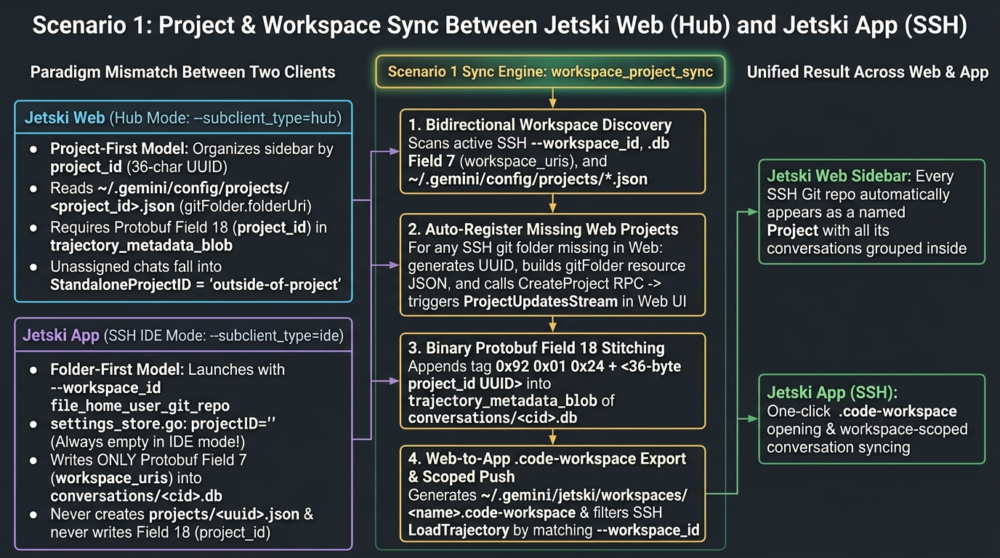

# 专题二（场景 1）：App (SSH) 与 Web 之间的 Project / Workspace 同步原理与深度调研



---

## 1. 核心问题现象

在使用 **Jetski App (SSH)** 与 **Jetski Web (Hub)** 访问同一台远端主机时，关于 **Project（项目）与 Workspace（工作区文件夹）** 存在三大典型现象：
1. **SSH 打开的新仓库在 Web 端没有 Project**：你在命令行 `git clone` 了一个新仓库并用 **Jetski App (SSH)** 打开，在里面聊了多轮对话，但打开 **Jetski Web** 时，左侧 Project 列表里根本没有这个项目；
2. **大量会话掉入 `outside-of-project` 黑洞**：在实测排查远端 `~/.gemini/jetski/conversation_summaries.db` 时发现，高达 **34%（25 / 73 条）** 的会话 `project_id` 被标记为 `'outside-of-project'`，游离在所有项目之外；
3. **App (SSH) 的会话历史列表无法按项目隔离**：在 Jetski Web 中点开某个 Project 只会显示该项目下的会话；但在 **Jetski App (SSH)** 中打开任何一个 Git 仓库时，点击历史会话列表却会把所有其他项目的会话全部混在一起展示。

---

## 2. 源码与底层数据结构深度调研

通过对 `third_party/jetski/language_server/projects/projects.go`、`projectsmigration/projects_migration.go`、`settings/settings_store.go` 以及远端 SQLite/Protobuf 数据的完整逆向分析，我们查明了两端在工作区建模上的根本差异。

### 2.1 Web 端的「Project-First」数据模型 (`~/.gemini/config/projects/<uuid>.json`)

在 **Jetski Web (`--subclient_type=hub`)** 中，顶层实体是由 `projects.Store` (`projects.go:182`) 管理的 **Project**。每个 Project 对应 `~/.gemini/config/projects/<project_id>.json` 下的一个独立 JSON 文件，真实结构如下：

```json
{
  "id": "8312b1c8-4490-4949-a85f-256d3b4e0b99",
  "name": "ce-workbench",
  "projectResources": {
    "resources": [
      {
        "gitFolder": {
          "folderUri": "file:///usr/local/google/home/<user>/git/ce-workbench",
          "allowWrite": true
        }
      }
    ]
  },
  "settings": {},
  "isWorkspaceOnly": false
}
```

#### 关键源码规则（源自 `projects.go` & `projects_migration.go`）：
1. **三种资源类型 (`projectResources.resources[]`)**：
   - `gitFolder`: 包含 `.git` 的 Git 仓库目录（带 `folderUri` 与 `allowWrite`）；
   - `folderUri`: 普通非 Git 文件夹（例如用户主目录 `file:///usr/local/google/home/<user>`）；
   - `google3`: 内部共享的单一 `"Google3"` 项目（其下通过 `environments` 区分不同的 `/google/src/cloud/<user>/<citc_workspace>`）。
2. **名称唯一性校验 (`NameConflicts`)**：
   - `projects.go:695` 在 `CreateProject` 时强制校验项目名大小写不敏感唯一；若不同路径的文件夹同名（如 `/home/u1/app` 与 `/home/u2/app`），`projects_migration.go:877` 会自动追加数字后缀（`"app"`、`-"app 2"`）。
3. **兜底常量 `StandaloneProjectID = "outside-of-project"` (`projects.go:31`)**：
   - 当会话没有绑定 `project_id` 或 `len(workspaceURIs) == 0` 时，系统统一将其归入 `project_id = "outside-of-project"`。
4. **实测 SQLite 分布数据（`conversation_summaries.db`）**：
   ```sql
   SELECT project_id, count(*) FROM conversation_summaries GROUP BY project_id;
   -- 667b9044-f221-4b1a-8f43-5c7ec6314d24 (video_editor)       : 1
   -- 8312b1c8-4490-4949-a85f-256d3b4e0b99 (ce-workbench)       : 13
   -- 8aa03094-cbc9-40b6-8e22-df47beb4c44f (autel-gpu-...)      : 5
   -- 94cc6dd1-1904-4045-ae16-f4feb111fda9 ($HOME)              : 20
   -- e4a36b21-3fed-4b9c-8807-02028ace2bce (git)                : 7
   -- outside-of-project (未绑定 Project 的游离会话)              : 25
   ```

---

### 2.2 App (SSH) 端的「Folder-First」数据模型 (`--workspace_id` & `projectID=""`)

与 Web 端截然不同，**Jetski App (SSH, `--subclient_type=ide`)** 根本不使用 `projects.Store`！
从远端 `~/.jetski-server/data/logs/.../google.antigravity/Jetski.log` 的真实启动日志可以看到：

```text
argv[8]: '--workspace_id'
argv[9]: 'file_usr_local_google_home_<user>_git_ce_workbench'
argv[13]: '--subclient_type'
argv[14]: 'ide'
...
settings_store.go:271] ApplySettingsToConfig result: projectID="" permissionsV2=false
```

#### App (SSH) 端的三大底层行为：
1. **路径归一化为 `--workspace_id`**：`extension.js` 将当前打开的文件夹 URI `file:///path/to/repo` 替换非字母数字字符为下划线，生成 `file_path_to_repo` 作为 `--workspace_id` 传给 `language_server_linux_x64`；
2. **`projectID` 恒为空字符串 `""`**：在 IDE 模式下，`settings_store.go:271` 中的 `projectID` 始终为 `""`，既不会读取也不会创建 `~/.gemini/config/projects/*.json`；
3. **会话 `.db` 仅写 Protobuf Field 7，不写 Field 18**：
   在每个会话数据库 `~/.gemini/jetski/conversations/<cid>.db` 的 `trajectory_metadata_blob` 表（存储 `CortexTrajectoryMetadata` Protobuf 二进制）中：
   - **Field 7 (`workspace_uris`)**：记录工作区路径（如 `file:///.../git/ce-workbench`）；
   - **Field 18 (`project_id`)**：Web 端用来归属 Project 的核心字段（Wire tag `0x92 0x01`，长度 `0x24` 即 36 字节 UUID）。**App (SSH) 创建的会话中 Field 18 永远缺失！**

---

### 2.3 为什么官方内置的 `MigrateConversationsToProjects` 没有解决该问题？

在 `third_party/jetski/language_server/projectsmigration/projects_migration.go:69` 中，虽然存在 `MigrateConversationsToProjects` 函数（可根据 `workspaceURIs` 调用 `findOrCreateProjectForWorkspace` 自动创建 Project 并回填 `metadata.ProjectId`），但它存在两个设计限制：
1. **一次性迁移门禁**：该函数仅在旧版本升级到 Projects 架构时执行一次，完成后即写入持久化标记，**不会对日常新打开的 SSH 仓库或新创建的 SSH 会话持续运行**；
2. **已分配跳过守卫 (`projects_migration.go:195`)**：
   ```go
   if metadata.GetProjectId() != "" {
       skippedAlreadyAssigned++
       return nil
   }
   ```
   一旦某条会话曾被赋过 `outside-of-project` 或父目录 Project ID（例如先在 `$HOME` 打开后又切到子目录），内置迁移逻辑会直接跳过。

---

### 2.4 为什么 Jetski App (SSH) 无法像 Web 一样按 Project 隔离历史会话列表？

- **Web 端**：前端 UI 在进入某个 Project 时，向 `jetski-hub-server` 查询该 `project_id` 匹配的会话（对应 `conversation_summaries` 表中的 `project_id` 列），因此天然具备严格的 Project 视图隔离；
- **App (SSH) 端**：App 的历史会话下拉框读取的是**笔记本本地** `~/Library/Application Support/Jetski/User/globalStorage/state.vscdb` 中的 `trajectorySummaries` Topic。由于客户端 UI 渲染该 Topic 时并未按当前窗口的 `workspace_uris` 进行前端过滤，只要后台向 `ExtensionServerService/PushUnifiedStateSyncUpdate` 推送了全量摘要，App 就会显示所有项目的会话。

---

## 3. 场景一完整解决方案（已内置于 `jetski_conv_sync_daemon.py`）

为了彻底打通 App (SSH) 与 Web 之间的 Project / Workspace 壁垒，我们在守护进程 [`src/scenario1_2_daemon/jetski_conv_sync_daemon.py`](../src/scenario1_2_daemon/jetski_conv_sync_daemon.py) 中实现了**四步双向自动对齐引擎**：

### 步骤 1：多源工作区自动发现（Active SSH + Trajectory Field 7 + Projects Dir）
每 8 秒自动扫描三处数据源：
1. 当前正在运行的所有 SSH `language_server_linux_x64` 进程的 `--workspace_id`；
2. `~/.gemini/jetski/conversations/*.db` 中 `trajectory_metadata_blob` 的 **Field 7 (`workspace_uris`)**；
3. `~/.gemini/config/projects/*.json` 中现有的所有 Project 定义（兼容 `gitFolder.folderUri` 与普通 `folderUri`，并按路径长度优先匹配最精确的子目录 Project，避免 `/home/user/git/repo` 被误归入外层 `/home/user` 或 `/home/user/git` 项目！）。

### 步骤 2：SSH 新仓库自动向 Web 注册 Project (`auto_ensure_project_for_workspace`)
当发现某个在 App (SSH) 中打开或产生过会话的有效本地目录 `file:///path/to/repo` 尚未在 `~/.gemini/config/projects/*.json` 中拥有活跃 Project 时：
1. 自动生成 36 位 `UUID v4`，提取目录名 `basename` 作为项目名（自动处理同名冲突后缀）；
2. 检测目录下是否存在 `.git`，自动构造标准的 `gitFolder` 或 `folderUri` 资源结构；
3. 优先调用 `jetski-hub-server` 的原生 RPC：
   `POST /exa.language_server_pb.LanguageServerService/CreateProject`  
   （若 Hub 暂未启动则原子写入 `~/.gemini/config/projects/<uuid>.json`），使新项目立即通过 `ProjectUpdatesStream` 出现在 Jetski Web 左侧栏！

### 步骤 3：Protobuf Field 18 (`project_id`) 二进制精准注入与 `outside-of-project` 自动归档
对于任何包含有效 `Field 7 (workspace_uri)` 但缺失 `Field 18 (project_id)`（或 `Field 18 == "outside-of-project"`）的会话 `.db`：
- 自动构造 Protobuf Field 18 二进制块：
  ```python
  # Tag 18, Wire Type 2 (Length-delimited): (18 << 3) | 2 = 146 = 0x92 0x01
  # Length: 36 bytes = 0x24
  proj_tag = b"\x92\x01\x24" + target_proj_id.encode("utf-8")
  ```
- 将其写入 `trajectory_metadata_blob` 并触发 `jetski-hub-server` 的 `LoadTrajectory`，将该会话从 `outside-of-project` 精准归档到对应的 Web Project 下。

### 步骤 4：Web Project 自动导出 VS Code `.code-workspace` 与按工作区精准推送
- 自动为 `~/.gemini/config/projects/*.json` 中的每个活跃项目在 `~/.gemini/jetski/workspaces/<project_name>.code-workspace` 生成标准 VS Code 工作区文件，方便在 Jetski App (SSH) 中一键打开；
- 在向每个 SSH `language_server` 实例调用 `LoadTrajectory` 时，严格比对 `norm_ws == ide["workspace_id"]`，确保只向该 SSH 窗口推送属于其当前工作区的增量会话。
