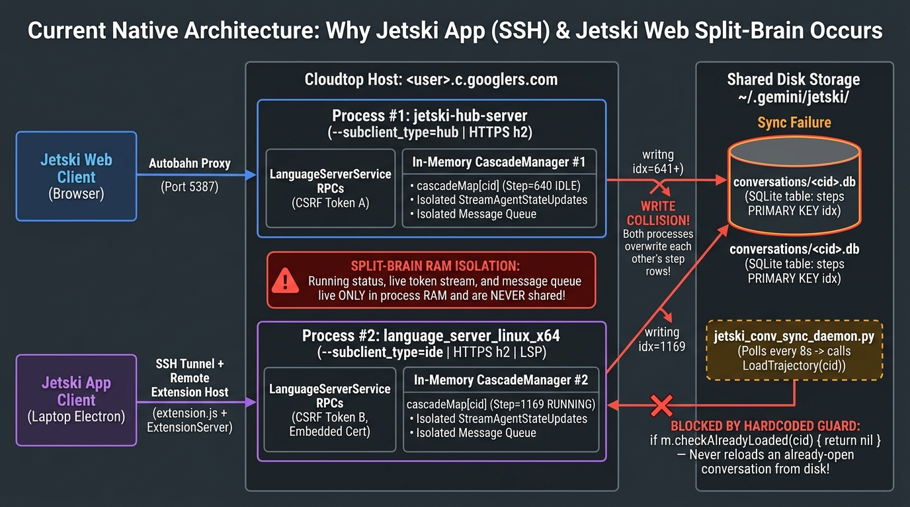
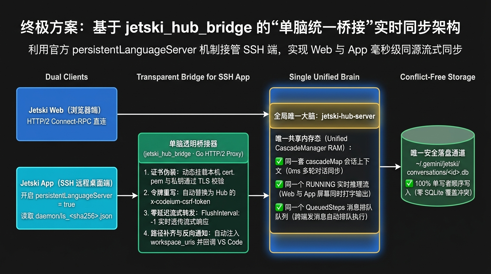
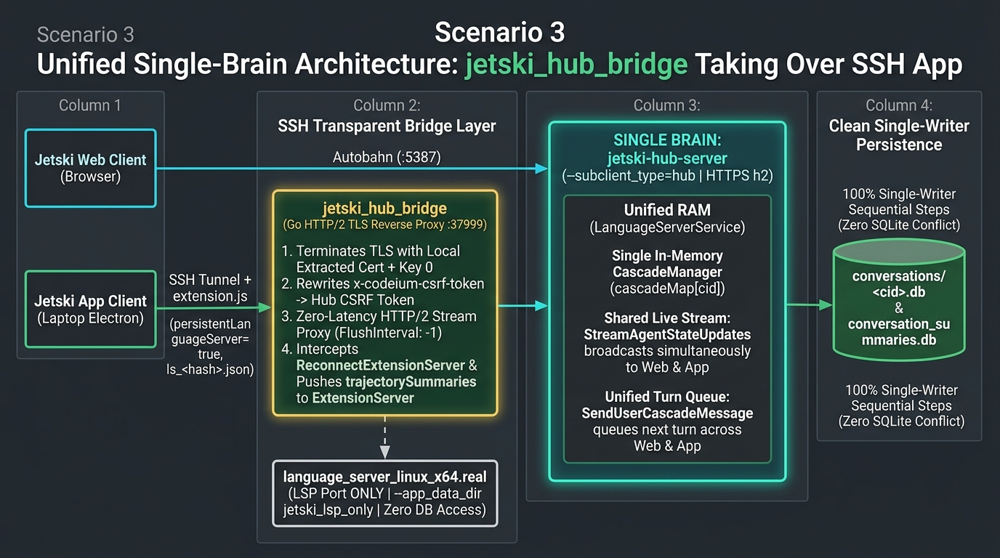

# 专题四（场景 3）：同一项目、同一 Conversation 内多轮对话与正在执行任务（`RUNNING` + 消息排队）的单脑实时同步

**[🇨🇳 简体中文](./04-scenario3-single-brain-bridge.md) | [🌐 English](./en/04-scenario3-single-brain-bridge.md) | [🏠 首页 (README)](../README.md)**

---

## 1. 场景定义与三大致命割裂现象

当你在同一个项目（如 `my-project`）的**同一个会话 (`conversation_id`)** 中交替使用 **Jetski App (SSH)** 与 **Jetski Web** 时，会出现以下三个严重问题：

1. **多轮对话不再同步**：某条会话在 Web 和 App 两端都点开过之后，你在 App 里继续聊了 10 轮（例如从第 640 步跑到第 1169 步），切回 Web 页面刷新，Web 端永远卡在第 640 步，哪怕重启 `jetski_conv_sync_daemon.py` 也无效；
2. **正在执行的任务状态 (`RUNNING`) 与流式输出不可见**：你在 App 里发起了一个长耗时任务（显示 `CASCADE_RUN_STATUS_RUNNING`，正在实时流式输出工具调用与思考过程），切到 Web 打开同一个会话，状态却显示为 `IDLE`，完全看不到正在执行的进度；
3. **跨端消息排队失效并引发 SQLite 覆写灾难（脑裂覆盖）**：当 App 正在第 1169 步执行任务时，如果你在 Web 端的同一个会话里输入下一句话（期望进入下一轮排队队列 `QueuedSteps`），Web 端会认为当前处于第 640 步 `IDLE` 并立刻从 `idx = 641` 开始执行，执行 `INSERT OR REPLACE INTO steps (idx=641...)`，**直接把 App 端刚刚写在 SQLite 磁盘里的第 641 步及后续记录覆盖抹除！**

---

## 2. 源码级根因铁证

#### 🇨🇳 中文版架构图 (Chinese Edition)


#### 🌐 英文版架构图 (English Edition)


### 根因 1：`cascade_manager.go:1454` 的 `checkAlreadyLoaded` 硬编码拦截
在 `third_party/jetski/cortex/cascade_manager.go` 的 `LoadTrajectory` 实现中，第一行就是内存去重检查：

```go
func (m *CascadeManager) LoadTrajectory(ctx context.Context, cascadeID string) error {
    if m.checkAlreadyLoaded(ctx, cascadeID) {
        return nil // ⚠️ 只要该会话已加载在本进程内存的 cascadeMap 中，直接返回 nil，绝不重新读盘！
    }
    // ...
}
```
而且整个 `LanguageServerService` 的 320 个 RPC 接口中，**没有任何一个接口支持将单个会话从 `cascadeMap` 内存中驱逐或强制从磁盘重载**。只要两个独立进程（Web 的 `jetski-hub-server` 与 App 的 `language_server_linux_x64`）各自把同一个 `cid` 读进了自己的内存字典，它们就永远只认自己内存里的快照。

### 根因 2：`RUNNING` 状态、流式通道与消息队列 100% 驻留单进程 RAM
- **实时流 (`StreamAgentStateUpdates`)**：订阅的是当前进程内存 `CascadeManager` 的 Go Channel；
- **下一轮消息排队 (`SendUserCascadeMessage` $\rightarrow$ `QueuedSteps`)**：当且仅当**当前进程内存**中的会话状态为 `CASCADE_RUN_STATUS_RUNNING` 时，新发出的消息才会被放入该进程内存的 `QueuedSteps` 队列中等待下一轮执行；这些运行时状态根本不经过 SQLite 磁盘。

### 根因 3：SQLite `steps` 表以步数序号 `idx` 作为主键
```sql
CREATE TABLE `steps` (
    `idx` integer,
    `step_type` integer,
    `data` blob,
    PRIMARY KEY (`idx`)
);
```
由于 `idx` 由每个进程各自内存里的步数计数器递增生成，一旦两个进程的内存步数不一致（例如 Web 在 `640`，App 在 `1169`），在落后的一端发送消息就会从旧序号开始 `INSERT OR REPLACE`，造成不可逆的步骤覆写。

---

## 3. 终极解决方案：`jetski_hub_bridge` 单脑透明桥接器（Unified Single-Brain Bridge）

#### 🇨🇳 中文版架构图 (Chinese Edition)


#### 🌐 英文版架构图 (English Edition)


既然 **Jetski App (SSH)** 的远程插件宿主（`extension.js`）和 **Jetski Web** 的 `jetski-hub-server` 本来就运行在**同一台 Cloudtop** 上，且两者都实现了完全相同的 320 个 `exa.language_server_pb.LanguageServerService` RPC 接口，那么解决同一会话实时同步的唯一正确方式就是：**消除第二个大脑，让 Jetski App (SSH) 直接连入 `jetski-hub-server`！**

### 3.1 为什么不能直接把 `jetski-hub-server` 的端口填给 App？
通过对 `~/.jetski-server/bin/.../extensions/antigravity/dist/extension.js`（模块 `32266`、`17689`、`55562`）的逆向分析，发现直接连接存在三个校验关卡：
1. **TLS 证书固定校验（Certificate Pinning）**：
   `extension.js`（模块 `55562`）及本地 Electron 客户端在连接 `https://127.0.0.1:<httpsPort>` 时，强制使用内置的 `dist/languageServer/cert.pem`（`SHA1: E037E5905BE4DD4A43E8F66907410ADC75AFAA95`）作为 CA 校验证书；而 `jetski-hub-server` 使用的是另一张动态生成的自签名证书；
2. **CSRF Token 隔离**：
   `extension.js` 使用每次生成的 UUID（或 discovery 文件中的 `csrfToken`）填充请求头 `x-codeium-csrf-token`，需与 `jetski-hub-server` 的实时 CSRF Token 对齐；
3. **`Exit` RPC 保护与 `ExtensionServer` 回调**：
   当关闭 SSH 窗口时，`extension.js` 会发送 `/LanguageServerService/Exit`；若直接连到 `jetski-hub-server` 会导致 Web 端服务被退出。

### 3.2 `jetski_hub_bridge` 的四步无感接管机制

我们在 [`src/scenario3_bridge/jetski_hub_bridge.go`](../src/scenario3_bridge/jetski_hub_bridge.go) 中实现了一个轻量级 Go HTTP/2 TLS 透明反向代理，并配合 `extension.js` 原生内置的 **`antigravity.persistentLanguageServer`** 机制完成无缝接管：

1. **利用 `extension.js` 原生热发现机制 (`module 17689 & 32266`) 与 `jetski_ls_shim.py` 轻量级 Shim**：
   - `extension.js` 每 1 秒运行一次 `maybeUpdate()` 检查配置项 `antigravity.persistentLanguageServer`、`codeiumDev.languageServerBinaryPath` 与 `codeiumDev.languageServerEnv`；
   - 当开启该选项时，`extension.js` 的 `discoverExistingLS()` 会读取 `~/.gemini/jetski/daemon/ls_<sha256(workspaceId)[:16]>.json`：
     ```json
     {
       "pid": 12345,
       "httpsPort": 37999,
       "httpPort": 37998,
       "lspPort": 37997,
       "csrfToken": "<bridge-or-hub-token>",
       "lsVersion": "<bin-dir-version-prefix>"
     }
     ```
   - **关键细节 (`lsVersion` 匹配)**：`extension.js` 的 `getExpectedLSVersion()` 校验的是 `~/.jetski-server/bin/<version>-<commit>` 目录名中 `-` 之前的版本号（如 `2.0.20260807053640`），而非 `package.json` 中的 `0.2.0`；`enable_unified_bridge.py` 自动提取该版本号写入 discovery 文件；
   - **零重启热切换 (`jetski_ls_shim.py`)**：通过将 `codeiumDev.languageServerBinaryPath` 指向 [`src/scenario3_bridge/jetski_ls_shim.py`](../src/scenario3_bridge/jetski_ls_shim.py) 并更新 `BRIDGE_EPOCH` 环境变量，`extension.js` 的 1 秒轮询循环会立即终止旧的独立 `language_server_linux_x64` 进程，并通过 `discoverExistingLS()` 或 Shim 的 `LanguageServerStarted` Protobuf 握手在 1 秒内无感挂载到 `jetski_hub_bridge` (`:37999`)，**全程无需 Reload Window**。
2. **动态提取本机 TLS 证书与私钥（零硬编码密钥）**：
   - 安装时由 [`extract_local_cert.py`](../src/scenario3_bridge/extract_local_cert.py) 从用户本机的 `$HOME/.jetski-server/bin/.../language_server_linux_x64` 提取内嵌私钥与 `cert.pem` 到本地运行目录（被 `.gitignore` 严格忽略），使 `jetski_hub_bridge` (`:37999`) 100% 通过 Electron 客户端与 `extension.js` 的 TLS 证书校验。
3. **HTTP/2 零延迟流式代理 (`FlushInterval: -1`) 与 CSRF 自动重写**：
   - `jetski_hub_bridge` 作为 `systemd --user` 常驻服务（[`jetski-hub-bridge.service`](../src/scenario3_bridge/jetski-hub-bridge.service)）运行，自动发现当前 `jetski-hub-server` 的 HTTPS 端口（兼容 `*:port` 与 `127.0.0.1:port`）及 CSRF Token（支持从命令行参数或 `:5387` HTML 的 `window.__APP_CONFIG__` 自动提取）；
   - 将所有 `/exa.language_server_pb.LanguageServerService/*` 请求头中的 `x-codeium-csrf-token` 替换为 Hub Token，并以 `FlushInterval: -1` 零缓冲转发 HTTP/2 流（包括 `StreamAgentStateUpdates` 实时流与 `SendUserCascadeMessage` 消息发送/排队）；
   - 拦截 `/Exit` 请求直接返回 `200 OK`，保护常驻的 `jetski-hub-server` 不被关闭。
4. **`ReconnectExtensionServer` 直接应答与侧边栏实时推送**：
   - 由于 `jetski-hub-server` 运行在 `--mode hub` 下未配置 `ExtensionServerClient`（若直接转发会报错 `extension server client not configured`），`jetski_hub_bridge` 直接拦截 `extension.js` 发来的 `/ReconnectExtensionServer` 请求并返回 `200 OK {}`；
   - 同时从请求体中解析最新的 `extensionServerPort` 与 `extensionServerCsrfToken`，每 2 秒自动将 `conversation_summaries.db` 中的最新摘要通过 `ExtensionServerService/PushUnifiedStateSyncUpdate` 推送给 App 侧边栏。

---

## 4. 开启单脑桥接后的完整收益

启用 `jetski_hub_bridge` 后，**Jetski App (SSH)** 与 **Jetski Web** 真正共享**同一个 `jetski-hub-server` 进程中的同一个 `CascadeManager` 内存实例**：
- ✅ **真·实时流同步（0ms 延迟）**：在 App 中发起任务，打开 Web 看到的就是正在实时滚动输出的同一个 `RUNNING` 会话（反之亦然）；
- ✅ **跨端统一消息排队（`QueuedSteps`）**：当任务在 App 中处于 `RUNNING` 时，在 Web 端输入下一轮指令，会自动进入同一个 `CascadeManager` 的下一轮排队队列，等当前轮次结束后无缝接续执行；
- ✅ **100% 杜绝 SQLite 写冲突**：全局只有唯一的 `jetski-hub-server` 进程向 `conversations/<cid>.db` 递增写入 `steps(idx)`，彻底消除脑裂覆盖。

