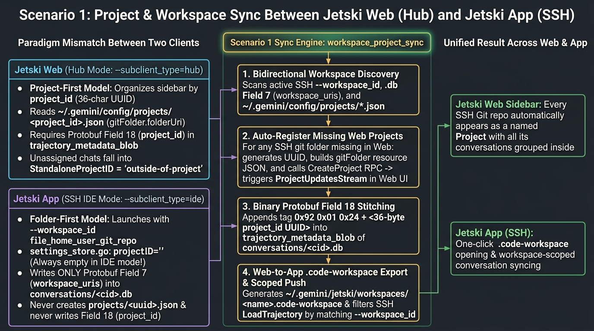

<div align="center">

# Topic 2 (Scenario 1): Project / Workspace Synchronization Between App (SSH) and Web

**[🇨🇳 简体中文](../02-scenario1-project-workspace.md) | [🌐 English](./02-scenario1-project-workspace.md) | [🏠 Home (README)](../../README_EN.md)**

</div>



---

## 1. Core Symptoms

When using **Jetski App (SSH)** and **Jetski Web (Hub)** against the same remote workstation, three Project / Workspace discrepancies emerge:
1. **New Git repos opened in SSH have no Project in Web**: You `git clone` a repository and open it in **Jetski App (SSH)**, chatting for several turns, but **Jetski Web**'s left sidebar shows no corresponding Project;
2. **Over 30% of conversations fall into the `outside-of-project` black hole**: Inspecting `~/.gemini/jetski/conversation_summaries.db` reveals that **34% (25 / 73)** of conversations have `project_id = 'outside-of-project'`;
3. **App (SSH) history dropdown is not isolated by Project**: Opening a Project in Web shows only conversations belonging to that Project, whereas App's history dropdown mixes conversations from all projects together.

---

## 2. Source Code & Underlying Data Model Analysis

By analyzing `third_party/jetski/language_server/projects/projects.go`, `projectsmigration/projects_migration.go`, `settings/settings_store.go`, and the SQLite/Protobuf schemas on disk, we identified a fundamental paradigm mismatch.

### 2.1 Web's "Project-First" Model (`~/.gemini/config/projects/<uuid>.json`)

In **Jetski Web (`--subclient_type=hub`)**, the top-level entity is a **Project** managed by `projects.Store` (`projects.go:182`). Each Project is stored as a JSON file at `~/.gemini/config/projects/<project_id>.json`:

```json
{
  "id": "8312b1c8-4490-4949-a85f-256d3b4e0b99",
  "name": "my-project",
  "projectResources": {
    "resources": [
      {
        "gitFolder": {
          "folderUri": "file:///usr/local/google/home/<user>/git/my-project",
          "allowWrite": true
        }
      }
    ]
  },
  "settings": {},
  "isWorkspaceOnly": false
}
```

#### Key Rules in `projects.go` & `projects_migration.go`:
1. **Three Resource Types (`projectResources.resources[]`)**:
   - `gitFolder`: Git repository directory containing `.git` (`folderUri` + `allowWrite`);
   - `folderUri`: Plain non-Git folder (e.g., `$HOME`);
   - `google3`: Shared `"Google3"` project distinguishing CitC workspaces under `environments`.
2. **Case-Insensitive Name Uniqueness (`NameConflicts`)**:
   - `projects.go:695` enforces unique project names during `CreateProject`; if two paths share a folder basename, `projects_migration.go:877` appends a numeric suffix (`"app"`, `"app 2"`).
3. **Fallback Constant `StandaloneProjectID = "outside-of-project"` (`projects.go:31`)**:
   - Any conversation without a `project_id` or with `len(workspaceURIs) == 0` is assigned `project_id = "outside-of-project"`.

---

### 2.2 App (SSH)'s "Folder-First" Model (`--workspace_id` & `projectID=""`)

Unlike Web, **Jetski App (SSH, `--subclient_type=ide`)** never uses `projects.Store`!  
From `~/.jetski-server/data/logs/.../google.antigravity/Jetski.log`:

```text
argv[8]: '--workspace_id'
argv[9]: 'file_usr_local_google_home_<user>_git_my_project'
argv[13]: '--subclient_type'
argv[14]: 'ide'
...
settings_store.go:271] ApplySettingsToConfig result: projectID="" permissionsV2=false
```

#### Three Underlying Behaviors in App (SSH):
1. **Path normalized to `--workspace_id`**: `extension.js` replaces non-alphanumeric characters in `file:///path/to/repo` with underscores and passes it as `--workspace_id`;
2. **`projectID` is always `""`**: In IDE mode, `settings_store.go:271` leaves `projectID` empty and never reads or writes `~/.gemini/config/projects/*.json`;
3. **Conversation `.db` writes Protobuf Field 7 ONLY, omitting Field 18**:
   Inside `trajectory_metadata_blob` (`CortexTrajectoryMetadata` Protobuf binary) of `~/.gemini/jetski/conversations/<cid>.db`:
   - **Field 7 (`workspace_uris`)**: Records the folder URI (`file:///.../git/my-project`);
   - **Field 18 (`project_id`)**: The 36-byte UUID required by Web (wire tag `0x92 0x01`, length `0x24`). **Conversations created in App (SSH) never write Field 18!**

---

### 2.3 Why Built-In `MigrateConversationsToProjects` Does Not Solve This

Although `projects_migration.go:69` includes `MigrateConversationsToProjects`, it has two design limitations:
1. **One-time migration gate**: It runs only once when upgrading from legacy versions and writes a completion marker, so it **never runs continuously for newly opened SSH repos or newly created SSH conversations**;
2. **Already-assigned guard (`projects_migration.go:195`)**:
   ```go
   if metadata.GetProjectId() != "" {
       skippedAlreadyAssigned++
       return nil
   }
   ```
   Once a conversation is tagged with `outside-of-project` or a parent folder's Project ID (e.g., `$HOME`), built-in migration skips it permanently.

---

## 3. Scenario 1 Complete Solution (Built into `jetski_conv_sync_daemon.py`)

In [`src/scenario1_2_daemon/jetski_conv_sync_daemon.py`](../../src/scenario1_2_daemon/jetski_conv_sync_daemon.py), we implemented a **4-step bidirectional alignment engine**:

1. **Multi-Source Workspace Discovery (Every 8s)**:
   Scans active SSH `--workspace_id` flags, `.db` Protobuf **Field 7 (`workspace_uris`)**, and `~/.gemini/config/projects/*.json` using **longest-prefix matching** so nested repos (`/home/user/git/my-project`) are never misassigned to parent folders (`/home/user` or `/home/user/git`).
2. **Auto-Register Missing Web Projects (`auto_ensure_project_for_workspace`)**:
   Generates a UUID v4, detects `.git`, and calls `POST /exa.language_server_pb.LanguageServerService/CreateProject` so new SSH repos immediately appear in the Jetski Web sidebar via `ProjectUpdatesStream`.
3. **Binary Protobuf Field 18 (`project_id`) Stitching & `outside-of-project` Rescue**:
   Appends `b"\x92\x01\x24" + target_proj_id.encode("utf-8")` into `trajectory_metadata_blob` and triggers `LoadTrajectory` on `jetski-hub-server`.
4. **Automatic `.code-workspace` Export & Workspace-Scoped Push**:
   Exports `~/.gemini/jetski/workspaces/<project_name>.code-workspace` for one-click opening in App (SSH) and filters SSH `LoadTrajectory` calls by matching `workspace_id`.
